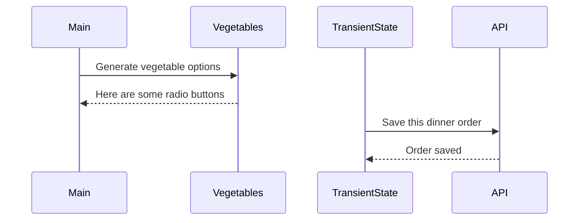

# Events and State Self-Assessment

> 🧨 Make sure you answer the vocabulary and understanding questions at the end of this document before notifying your coaches that you are done with the project

## Setup

1. Make sure you are in your `workspace` directory
1. `git clone {github repo SSH string}`
1. `cd` into the directory it creates
1. `code .` to open the project code
1. Use the `serve` command to start the web server
1. Open the URL provided in Chrome

## Requirements

### Initial Render

1. All 10 base dishes should be displayed as radio input options.
1. All 9 vegetables should be displayed as radio input options.
1. All 6 side dishes should be displayed as radio input options.
1. All previously purchases meals should be displayed below the meal options. Each purchase should display the primary key and the total cost of the purcahsed meal.

### State Management

1. When the user selects an item in any of the three columns, the choice should be stored as transient state.
1. When a user makes a choice for all three kinds of food, and then clicks the "Purchase Combo" button, a new sales object should be...
    1. Stored as permanent state in your local API.
    1. Represented as HTML below the **Monthly Sales** header in the following format **_exactly_**. Your output will not have zeroes, but the actual amount.
        ```html
        Receipt #1 = $00.00
        ```
   1. The user's choices should be cleared from transient state once the purchase is made.

## Design

Given the description and animation above...

1. Create an ERD for this application before you begin.
1. Make a list of what modules need to be created to make your application as modular as possible. Create a **Dependency Graph** for the project to be reviewed once you are complete with the assessment.
1. Create a **Sequence Diagram** that visualizes what your algorithm is for this project. We'll give you a minimal starting point.



## Vocabulary and Understanding

> 🧨 Before you click the "Assessment Complete" button on the Learning Platform, add your answers below for each question and make a commit. It is your option to request a face-to-face meeting with a coach for a vocabulary review.

1. Should transient state be represented in a database diagram? Why, or why not?
   > No, transient state shouldn't be in a database diagram. A database diagram is for modeling permanent state—the data that gets stored long-term in the database. Transient state is temporary; it only exists in the application's memory while the user is making selections. Once the user makes a purchase, that transient data is used to create a permanent record, and then the transient state is cleared.
2. In the **FoodTruck** module, you are **await**ing the invocataion of all of the component functions _(e.g. sales, veggie options, etc.)_. Why must you use the `await` keyword there? Explain what happens if you remove it.
   > The component functions like `SalesHistory` and `VegetableOptions` are `async` because they need to `fetch` data from the API, which is an asynchronous operation. This means they return a Promise, not the final HTML string. You have to use `await` to pause the function's execution until those Promises resolve and the actual HTML is available. If you remove `await`, you would be trying to inject a `[object Promise]` into the DOM instead of the rendered HTML, which would result in a broken display.
3. When the user is making choices by selecting radio buttons, explain how that data is retained so that the **Purchase Combo** button works correctly.
   > When a user clicks a radio button, a "change" event listener in `main.js` is triggered. This listener identifies which option was chosen and calls a setter function (e.g., `setEntree`) from the `TransientState.js` module. This function updates a `transientState` object with the `id` of the user's choice. This object holds onto all the selections until the "Purchase Combo" button is clicked, at which point the `addNewSale` function can access the complete order from the transient state.
4. You used the `map()` array method in the self assessment _(at least, you should have since it is a learning objective)_. Explain why that function is helpful as a replacement for a `for..of` loop.
   > The `.map()` method is helpful because it's designed specifically for transforming each item in an array into something new and returning a new array of the transformed items. In this project, it takes an array of data objects (like entrees) and transforms each one into an HTML string. It's more concise than a `for..of` loop, which would require you to declare an empty array, loop through the original data, manually `push` each new HTML string into the new array, and then finally join it. `.map()` handles the creation of the new array implicitly.
